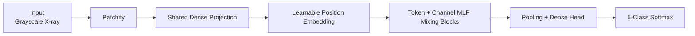

# Competition Report
## Chest X-ray Classification (5 Classes)

## 1. Overview
This project targets 5-class chest X-ray classification using a dense-only neural network design.  
The final model uses a patch-based representation of the image and mixes information across patches and channels through MLP-style blocks.  
The main objective was to improve macro F1-score while keeping training and inference reliable.

## 2. Final Model Idea
The final architecture follows this flow:
- Convert input image to grayscale and normalize.
- Resize to a fixed working size and split into non-overlapping patches.
- Apply a shared dense projection to each patch.
- Add learnable positional embeddings so the model keeps spatial context.
- Use token-mixing and channel-mixing MLP blocks with skip connections.
- Aggregate features with global pooling and predict with a final softmax layer.

This design was chosen to capture both local texture and global chest structure without convolution.  
Since this is a medical imaging setting, global visible changes (for example consolidation or enlarged cardiac silhouette) were important to preserve.

Reference used for model-style inspiration:
- https://github.com/jeonsworld/MLP-Mixer-Pytorch/blob/main/README.md

## 3. Training Strategy and Improvements
Key ideas used during development:

- **Multi-network in parallel (experiment):**  
  I tried parallel branch training with balanced subsets, but it did not lead to a significant F1 gain in my final runs, so it was not the main final direction.

- **Class-aware training:**  
  Class-balanced sampling and class weighting were used to reduce minority-class collapse (especially class 5).  
  This improved sensitivity to rare classes, but also created a clear trade-off with overfitting risk.

### More technical view of the class-aware setup

I used:
- `BALANCE_TEMPERATURE = 0.6`
- `CLASS_WEIGHT_MAP = {0: 1.0, 1: 1.1, 2: 1.0, 3: 1.05, 4: 1.7}`

Sampling probability per class in the balanced data pipeline:

$$
P(c) \propto n_c^{T}, \quad T=0.6
$$

where \(n_c\) is class count.

Interpretation:
- \(T=1\): keep original class distribution
- \(T=0\): equal probability for all classes
- \(0<T<1\): partial balancing (my setting)

Weighted classification loss:

$$
\mathcal{L}=\frac{1}{N}\sum_{i=1}^{N} w_{y_i}\,\mathrm{CE}(y_i,\hat{y}_i)
$$

So class 5 errors (\(w=1.7\)) produce larger gradients.  
In practice, balanced sampling + class weights increased minority attention, but if pushed too hard, class-5 overfitting became a bottleneck.

- **F1-driven monitoring:**  
  I implemented custom callbacks to report per-class F1 for both train and validation.  
  This made weak classes visible early and helped diagnose overfitting by class, not just by average accuracy.

- **Mild augmentation:**  
  Horizontal flipping and small rotations improved robustness without heavy distortion of medical patterns.

- **Stable optimization:**  
  AdamW + learning-rate scheduler + early stopping gave more stable training behavior.

I used `ReduceLROnPlateau` with:
- factor: `0.5`
- patience: `5`
- min lr: `1e-6`
- monitor: validation macro-F1

Update rule at plateau:

$$
\eta \leftarrow 0.5\,\eta
$$

This helped move from faster early learning to more stable late-stage convergence and reduced oscillation in later epochs.

## 4. Results

### 4.1 Per-Class F1 (Current Run)

| Class   | Train F1 | Validation F1 |
|---------|----------|---------------|
| Class 1 | 0.4462   | 0.4330        |
| Class 2 | 0.3962   | 0.3070        |
| Class 3 | 0.5044   | 0.3968        |
| Class 4 | 0.4508   | 0.3159        |
| Class 5 | 0.3849   | 0.1548        |
| **Macro F1** | **0.4365** | **0.3215** |

### 4.2 Final Test Metric
- **Test macro F1-score: 0.3449**

## 5. Architecture Diagram

### 5.1 High-Level Diagram

### 5.2 Detailed Architecture (with purpose of each part)

- **Resize to 120x120**  
  Why: reduce memory/computation while keeping global chest anatomy visible.

- **8x8 non-overlapping patches (225 tokens)**  
  Why: convert the image into local regions so dense layers can learn local-to-global patterns.

- **Shared dense projection to 128 dims**  
  Why: learn compact patch features with shared parameters.

- **Learnable positional embedding**  
  Why: preserve spatial context (upper/lower lung, heart region, diaphragm area).  
  Note: this part was implemented with AI assistance.

- **3 mixer blocks**  
  Why: enough depth for interaction without unstable optimization.

- **Token-mixing MLP (64 hidden)**  
  Why: exchange information across patches (global reasoning).

- **Channel-mixing MLP (256 hidden)**  
  Why: enrich transformation inside each patch token.

- **Dense-style skip connectivity (concat + projection)**  
  Why: improve gradient flow, reuse features, and stabilize training.

- **Global average pooling**  
  Why: summarize token-level information into one image-level descriptor.

- **Dense(256) + Dropout + Softmax(5)**  
  Why: final nonlinear decision layer, regularization, and class probability output.

## 6. Discussion
The strongest gains came from combining:
1. Patch-based dense modeling with positional information
2. Class-aware training for imbalance
3. Per-class F1 monitoring for targeted iteration

This combination improved macro F1 and made failure modes clearer, especially for difficult minority classes.

## 7. Conclusion
The final system achieved competitive macro F1 with a compact and interpretable dense-only design.  
Future gains are likely from better minority-class generalization and calibration.

## 8. Fun Note
One funny point about my nickname **Ersa**: it was named by a Twitter contest.  
In 2019, the Carnegie Institution for Science ran a naming contest for five newly discovered moons of Jupiter.  
A school in Canada suggested **Ersa**, and the name was approved by the International Astronomical Union.
